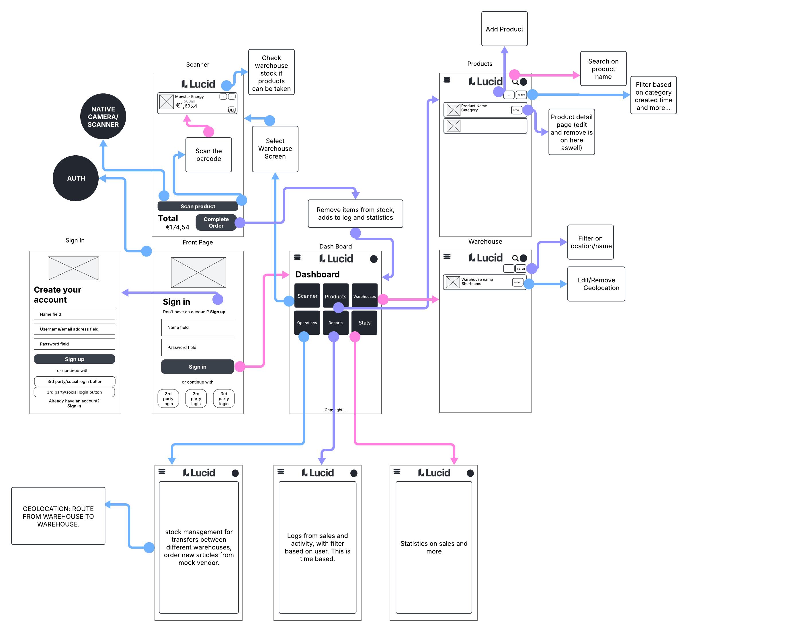

# Projectdoelen - MDE

*gebruik dit markdown bestand om je project te beschrijven en je geplande features aan te duiden.*

## Beschrijving

**Inventory Management System**

**Doel van de app**: 
Het doel van de app is om de voorraad van producten in verschillende magazijnen of winkels effectief te beheren. 
De app stelt gebruikers in staat om de voorraad bij te houden en nieuwe producten te bestellen wanneer de voorraad laag is. 
Bij het scannen van een barcode wordt de voorraad automatisch aangepast, afhankelijk van de locatie van het magazijn of de winkel.

**Oplossing voor een probleem**: 
De app biedt een gestroomlijnde oplossing voor voorraadbeheer, waardoor bedrijven real-time inzicht krijgen in hun productvoorraad. 
Bovendien maakt de app het mogelijk om automatisch labels af te drukken die snel in de winkel kunnen worden aangebracht, waarbij de barcode direct wordt geïntegreerd in het systeem.

**Doelgroep van de app**: 
Deze app is ontworpen voor grote bedrijven die hun voorraad willen volgen en beheren, met name voor organisaties die meerdere magazijnen of winkels hebben. 
Het is ook geschikt voor bedrijven die interne voorraadtransfers willen uitvoeren om een optimale voorraadniveaus te behouden.

**Gebruik van de app**: 
De app zal beschikbaar zijn op de platformen Android en iOS, met speciale nadruk op de tabletversie voor gebruiksgemak in de bedrijfsomgeving.

## Online strategie

Kruis je online **strategie** aan:

- [ ] Online CRUD operaties met een Backend Service
- [ ] Online Fetch, Offline CRUD
- [ ] Offline CRUD, Online Push
- [X] Online CRUD operaties met eigen REST API
- [ ] Andere, namelijk: 

## Mobile features

Kruis je geplande **mobile features** aan:

- [X] Platformintegraties
      noteer welke: 
      **Location, Scanning (image barcode)**
- [X] Push notifications
- [ ] 2D Graphics
- [X] Authentication en Authorization
- [ ] Native Communication
- [ ] Native Speech to Text
- [ ] Cross-platform Native Plugin
- [ ] Andere, namelijk: 

## Wireframes

